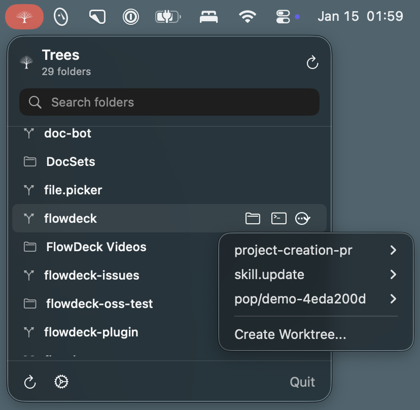

# Trees

Latest download: https://github.com/afterxleep/trees/releases/latest

Trees is a macOS menu bar app for browsing repositories and creating git worktrees inside your developer folder.

## Highlights

- Fast list of folders with git detection and search.
- One-click worktree creation with terminal launch.
- Quick actions for Finder and Terminal.

## Quick Start

1. Open `Trees.xcodeproj` in Xcode.
2. Select the `Trees` scheme and run on `My Mac`.
3. Open Settings to set your developer folder and preferred terminal.

## Usage

1. Click the Trees menu bar icon.
2. Search or select a repository.
3. Use the actions menu to create a worktree or open the repo.

## Settings

- Developer Folder: the root directory to scan for repositories.
- Terminal: the app used when opening repos or worktrees.

## Requirements

- macOS 14.0+
- Xcode 15+ (Swift 5.9)
- Git available at `/usr/bin/git`

## Development

- Run tests: `xcodebuild test -scheme Trees -destination 'platform=macOS'`
- The app runs as a menu bar extra and does not appear in the Dock.

## Release Checklist

1. Update version numbers in `Trees/Info.plist`.
2. Run tests: `xcodebuild test -scheme Trees -destination 'platform=macOS'`.
3. Archive the app from Xcode for distribution.

## Notes

- Terminal support includes Terminal, iTerm, Ghostty, Warp, and Alacritty.
- If the selected terminal is not installed, Trees shows an error message.
